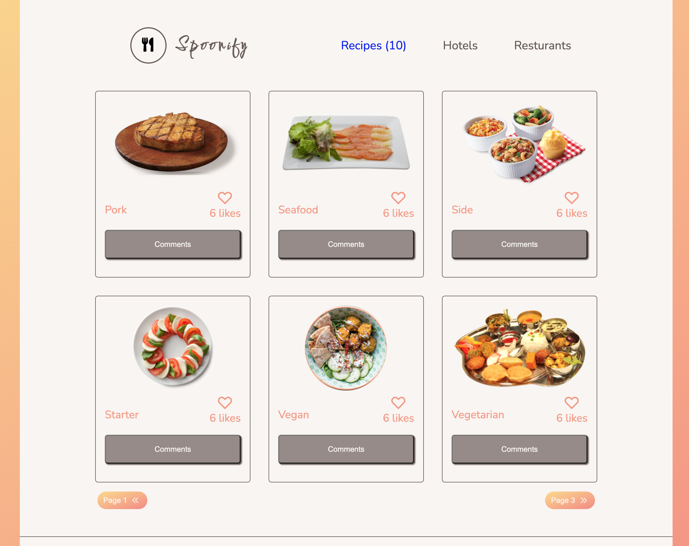

# The Spoonify Recipe App.

> This app helps you search all recipes on the internet and provides you with all necessary information you need about the recipe. You can comment, reserve or like a recipe.

## Built With

- HTML, CSS and Js (ES6).
- No Frameworks
- Webpack
- Git, Github and VsCode.
  -Jest framework

### Live Demo

- Click [here]() for the live site.

### Video Demo

- Click [here](https://drive.google.com/file/d/1wZM0TTMX-FRgwLxTkfpAQY_wYMVqOgkR/view?usp=sharing) for the video demo.

## Getting Started

To get a local copy up and running follow these simple example steps.

### Prerequisites

- A modern upto-date browser
- Text Editor or IDE

### Setup

1.  Clone the Repo or Download the Zip file or `https://github.com/billionsjoel/spoonify.git`.
2.  `cd/spoonify`

### Install

After cloning the project you need to run these commands

- `npm install` `This command will download all the dependancies of the project`
- `npm run build`
- `npm run start`

### Tests

- run npm test

### Usage

- open index.html file with a server or localhost.

## Authors

👤 ** Atugonza Billions joel **

- GitHub: [@billionsjoel](https://github.com/billionsjoel)
- Twitter: [@billionsjoel](https://twitter.com/BillionsJoel)
- LinkedIn: [billionsjoel](https://www.linkedin.com/in/billionsjoel/)

👤 ** Tresor Sawasawa **

- GitHub: [@tresorsawasawa](https://github.com/tresorsawasawa)
- Twitter: [@tresorsawasawa](https://twitter.com/TresorSawasawa)
- LinkedIn: [Trésor Sawasawa](https://www.linkedin.com/in/tr%C3%A9sor-sawasawa-43745320b/)

## 🤝 Contributing

Contributions, issues, and feature requests are welcome!

Feel free to check the [issues page](../../issues/).

## Show your support

Give a ⭐️ if you like this project!

## Acknowledgments

- Hat tip to anyone whose code was used
- Inspiration
- etc

## 📝 License

This project is [MIT](./MIT.md) licensed.
